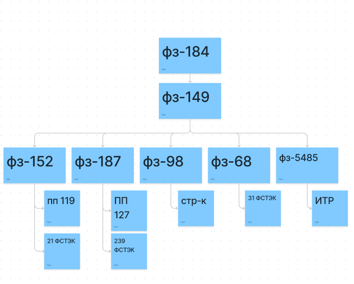

# Иерархия ФЗ для информационной безопасности

## Диаграмма иерархии

## Содержание ФЗ:

### ФЗ-184

### **"О техническом регулировании"**

Федеральный закон регулирует отношения, возникающие при:

* разработке, принятии, применении и исполнении обязательных требований к продукции, в том числе зданиям и сооружениям (далее - продукция), или к продукции и связанным с требованиями к продукции процессам проектирования (включая изыскания), производства, строительства, монтажа, наладки, эксплуатации, хранения, перевозки, реализации и утилизации.

* применении и исполнении на добровольной основе требований к продукции, процессам проектирования (включая изыскания), производства, строительства, монтажа, наладки, эксплуатации, хранения, перевозки, реализации и утилизации, а также к выполнению работ или оказанию услуг в целях добровольного подтверждения соответствия;

* оценке соответствия

* Настоящий Федеральный закон также определяет права и обязанности участников регулируемых настоящим Федеральным законом отношений.

  http://www.consultant.ru/document/cons_doc_LAW_40241/
  
  ---

### ФЗ-149

### **"Об информации, информационных технологиях и о защите информации"**

Федеральный закон регулирует отношения, возникающие при:

* осуществлении права на поиск, получение, передачу, производство и распространение информации

* применении информационных технологий

* обеспечении защиты информации

  http://www.consultant.ru/document/cons_doc_LAW_61798/
  
  ---

### ФЗ-152

###  **"О персональных данных"** 

Федеральный закон регулирует отношения, связанные с обработкой персональных данных, осуществляемой федеральными органами государственной власти, органами государственной власти субъектов Российской Федерации, иными государственными органами (далее - государственные органы), органами местного самоуправления, иными муниципальными органами (далее - муниципальные органы), юридическими лицами и физическими лицами с использованием средств автоматизации, в том числе в информационно-телекоммуникационных сетях, или без использования таких средств, если обработка персональных данных без использования таких средств соответствует характеру действий (операций), совершаемых с персональными данными с использованием средств автоматизации, то есть позволяет осуществлять в соответствии с заданным алгоритмом поиск персональных данных, зафиксированных на материальном носителе и содержащихся в картотеках или иных систематизированных собраниях персональных данных, и (или) доступ к таким персональным данным.

Положения настоящего Федерального закона применяются к обработке персональных данных граждан Российской Федерации, осуществляемой иностранными юридическими лицами или иностранными физическими лицами, на основании договора, стороной которого являются граждане Российской Федерации, иных соглашений между иностранными юридическими лицами, иностранными физическими лицами и гражданами Российской Федерации либо на основании согласия гражданина Российской Федерации на обработку его персональных данных.

http://www.consultant.ru/document/cons_doc_LAW_61801/

#### Зависимости:

##### ПП-119

##### ФСТЭК-21

**"Об утверждении Состава и содержания организационных и технических мер по обеспечению безопасности персональных данных при их обработке в информационных системах персональных данных"**

Меры по обеспечению безопасности персональных данных принимаются для защиты персональных данных от неправомерного или случайного доступа к ним, уничтожения, изменения, блокирования, копирования, предоставления, распространения персональных данных, а также от иных неправомерных действий в отношении персональных данных.

Безопасность персональных данных при их обработке в информационной системе персональных данных (далее - информационная система) обеспечивает оператор или лицо, осуществляющее обработку персональных данных по поручению оператора в соответствии с законодательством Российской Федерации. Для выполнения работ по обеспечению безопасности персональных данных при их обработке в информационной системе в соответствии с законодательством Российской Федерации могут привлекаться на договорной основе юридическое лицо или индивидуальный предприниматель, имеющие лицензию на деятельность по технической защите конфиденциальной информации.

http://www.consultant.ru/document/cons_doc_LAW_146520/

---

### ФЗ-187

### **"О безопасности критической информационной инфраструктуры Российской Федерации"**

Настоящий Федеральный закон регулирует отношения в области обеспечения безопасности критической информационной инфраструктуры Российской Федерации (далее также - критическая информационная инфраструктура) в целях ее устойчивого функционирования при проведении в отношении ее компьютерных атак.

http://www.consultant.ru/document/cons_doc_LAW_220885/

#### Зависимости:

##### ПП-127

**Об утверждении правил категорирования объектов критической информационной инфраструктуры Российской федерации, а также перечня показателей  критериев значимости объектов критической информационной инфраструктуры Российской Федерации и их значений**

https://fstec.ru/tekhnicheskaya-zashchita-informatsii/obespechenie-bezopasnosti-kii/287-postanovleniya/1614-postanovlenie-pravitelstva-rossijskoj-federatsii-ot-8-fevralya-2018-g-n-127

##### ФСТЭК-239

**ОБ УТВЕРЖДЕНИИ ТРЕБОВАНИЙ ПО ОБЕСПЕЧЕНИЮ БЕЗОПАСНОСТИ ЗНАЧИМЫХ ОБЪЕКТОВ КРИТИЧЕСКОЙ ИНФОРМАЦИОННОЙ ИНФРАСТРУКТУРЫ РОССИЙСКОЙ ФЕДЕРАЦИИ**

https://fstec.ru/normotvorcheskaya/akty/53-prikazy/1592-prikaz-fstek-rossii-ot-25-dekabrya-2017-g-n-239

---

### ФЗ-98

### **"О коммерческой тайне"**

Федеральный закон регулирует отношения, связанные с установлением, изменением и прекращением режима коммерческой тайны в отношении информации, которая имеет действительную или потенциальную коммерческую ценность в силу неизвестности ее третьим лицам.

http://www.consultant.ru/document/cons_doc_LAW_48699/

#### Зависимости:

##### СТР-К

**СПЕЦИАЛЬНЫЕ ТРЕБОВАНИЯ И РЕКОМЕНДАЦИИ ПО ТЕХНИЧЕСКОЙ ЗАЩИТЕ КОНФИДЕНЦИАЛЬНОЙ ИНФОРМАЦИИ**

https://wikisec.ru/index.php?title=%D0%A1%D0%BF%D0%B5%D1%86%D0%B8%D0%B0%D0%BB%D1%8C%D0%BD%D1%8B%D0%B5_%D1%82%D1%80%D0%B5%D0%B1%D0%BE%D0%B2%D0%B0%D0%BD%D0%B8%D1%8F_%D0%B8_%D1%80%D0%B5%D0%BA%D0%BE%D0%BC%D0%B5%D0%BD%D0%B4%D0%B0%D1%86%D0%B8%D0%B8_%D0%BF%D0%BE_%D1%82%D0%B5%D1%85%D0%BD%D0%B8%D1%87%D0%B5%D1%81%D0%BA%D0%BE%D0%B9_%D0%B7%D0%B0%D1%89%D0%B8%D1%82%D0%B5_%D0%BA%D0%BE%D0%BD%D1%84%D0%B8%D0%B4%D0%B5%D0%BD%D1%86%D0%B8%D0%B0%D0%BB%D1%8C%D0%BD%D0%BE%D0%B9_%D0%B8%D0%BD%D1%84%D0%BE%D1%80%D0%BC%D0%B0%D1%86%D0%B8%D0%B8_(%D0%A1%D0%A2%D0%A0-%D0%9A)

---

### ФЗ-68

### **"О защите населения и территорий от чрезвычайных ситуаций природного и техногенного характера"**

Настоящий Федеральный закон определяет общие для Российской Федерации организационно-правовые нормы в области защиты граждан Российской Федерации, иностранных граждан и лиц без гражданства, находящихся на территории Российской Федерации (далее - население), всего земельного, водного, воздушного пространства в пределах Российской Федерации или его части, объектов производственного и социального назначения, а также окружающей среды (далее - территории) от чрезвычайных ситуаций природного и техногенного характера (далее - чрезвычайные ситуации).

http://www.consultant.ru/document/cons_doc_LAW_5295/

#### Зависимости:

##### ФСТЭК-31

Об утверждений  требований к обеспечению защиты информации в автоматизированных системах управления производственными и технологическими процессами на критически важных объектах, потенциально опасных объектах, а также объектах, представляющих повышенную опасность для жизни и  здоровья людей и для окружающей природной среды

https://fstec.ru/normotvorcheskaya/akty/53-prikazy/868-prikaz-fstek-rossii-ot-14-marta-2014-g-n-31

### ФЗ-5485

### **"О государственной тайне"**

Настоящий Закон регулирует отношения, возникающие в связи с отнесением сведений к государственной тайне, их засекречиванием или рассекречиванием и защитой в интересах обеспечения безопасности Российской Федерации.

http://www.consultant.ru/document/cons_doc_LAW_2481/

#### Зависимости:

##### ИТР(?)
